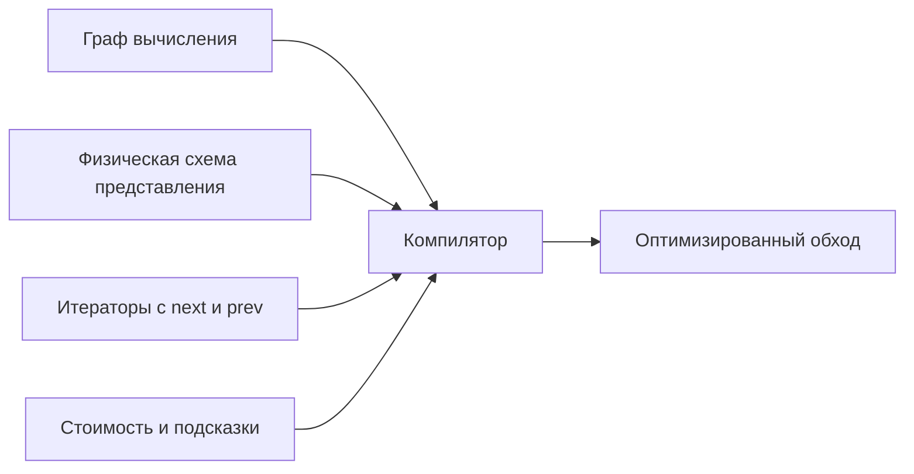

# Компоновка и представление

Статус: рабочий документ для последовательного утверждения модели.

Мы рассматриваем по одному содержательному вопросу. Каждый следующий шаг
опирается только на уже принятые решения. Неутверждённый синтаксис не выдаётся
за существующий синтаксис Efen.

## Задача

Нужно разделить три уровня:

1. логический смысл структуры данных;
2. её физическое представление;
3. операции конкретной памяти, файла или устройства.

Основной пример — массив структур:

```efen
struct X {
    var a: Int
    var b: Float
}
```

Его можно хранить построчно:

```text
[{ a: 1, b: 2.0 }, { a: 3, b: 4.0 }]
```

или по колонкам:

```text
a = [1, 3]
b = [2.0, 4.0]
```

Оба варианта сохраняют один смысл массива, но образуют разные конкретные типы.
Они получаются из одного обобщённого типа `Array<X, R>`, где `R` задаёт
представление массива.

Представление может менять не только расположение полей. Например, допустимы:

```efen
Array<X, Contiguous>
Array<X, List>
Array<X, DoubleLinkedList>
Array<X, Columnar>
```

Во всех случаях `Array` остаётся логической упорядоченной последовательностью.
Физически элементы могут лежать подряд, образовывать односвязный или
двусвязный список либо быть разделены на колонки.

## Основание модели

### Компилятор как программа на Efen

Компилятор Efen сам по существу является программой на Efen. Контракты и аспекты
нужны в том числе для описания его расширяемого поведения.

Поэтому представление массива не должно быть жёстко записано отдельной веткой
компилятора. `Array` определяет контракт на Efen, `Columnar` выполняет его как
аспект на Efen, а программа времени компиляции применяет аспект и проверяет
контракт. Специальная встроенная операция нужна только там, где обычные средства
языка принципиально не могут выразить необходимое действие.

### Логический тип и его представление

Цель — определить `Array<X, R>` в стандартной библиотеке обычным кодом Efen.
Такой библиотеки пока нет. `X` будет задавать тип элемента, а `R` —
представление конкретного массива.

Проектирование `Array` является проверкой всей модели. Если язык предоставляет
правильные возможности для компоновки и представления, стандартный массив не
потребует отдельной встроенной реализации в компиляторе.

Сам обобщённый тип определяет смысл своих данных и операций. Для массива это
означает:

- элементы образуют упорядоченную последовательность;
- `count` сообщает количество элементов;
- индекс обозначает определённый элемент последовательности;
- если тип поддерживает изменение длины, `append` добавляет элемент в конец, а
  удаление изменяет последовательность по правилам массива.

Эти свойства не зависят от выбранного `R`. Представление не может сделать так,
чтобы индекс обозначал другой элемент. Возможность менять длину выражается
отдельным контрактом. Поэтому массив постоянной длины остаётся массивом, но не
предоставляет `append`, вставку и удаление.

Если для `R` предусмотрено значение по умолчанию, запись `Array<X>` является
сокращением полной конкретизации обобщённого типа. Массивы с разными `R`
остаются разными конкретными типами.

### Компоновка (`layout`)

`layout` описывает логическое пространство памяти:

- какие значения существуют;
- как они связаны;
- какие логические указатели и диапазоны можно получить;
- какие условия должны всегда выполняться;
- какие операции разрешены над структурой.

Компоновка не обязана выбирать ОЗУ, файл, страницы, блоки или формат размещения.

### Представление

Представление является аспектом. Оно определяет, как сохранить физически уже
заданный логический смысл.

Целевой тип передаётся аспекту обычным обобщённым параметром:

```efen
aspect Columnar<Target> conforms Representation<Target> {
    // Содержимое будет определено после утверждения полномочий представления.
}
```

`Target` не является скрытой переменной. Аспект получает его по обычным правилам
обобщённого программирования.

Обобщённый тип `Array<X, R>` сам объявляет параметр `R` и применяет его как своё
представление. Внешний код не может назначить представление типу, который не
предусмотрел соответствующий обобщённый параметр.

Разные представления создают разные конкретные типы. Построчный и колоночный
массивы не являются одним типом с незаметно изменившимся устройством.

Представление вправе менять стоимость операций. Например, индексирование может
быть непосредственным у `Contiguous`, последовательным у `List` и выбирать
ближайший конец у `DoubleLinkedList`. Наблюдаемый смысл индексирования при этом
сохраняется.

Представление само проверяет применимость к целевому типу. Нарушение его
контракта является ошибкой при построении конкретного типа.

После применения аспект обязан определить всё физическое устройство и все
операции, необходимые конкретному типу. Если чего-либо не хватает, построение
типа завершается ошибкой компиляции.

### Эффекты доступа

Физический доступ может обращаться к ОЗУ, файлу, кешу, каналу DMA или другому
устройству. Возникающие исключения и приостановка могут выводиться автоматически.
Логический алгоритм при этом может сохранять обычное обращение к значению.

Индексирование не является отдельным скрытым обращением к представлению.
Выражение `array[index]` компилятор преобразует в вызов соответствующего метода
и ищет этот метод в конкретном типе `Array<X, R>`. После применения `R` методы,
добавленные аспектом, входят в этот тип и участвуют в обычном поиске.

Конкретное действие зависит от контекста выражения:

```efen
array[index] = value       // запись элемента
let value = array[index]   // чтение элемента
let slice = array[1..5]    // получение структуры среза
```

Контракт массива задаёт соответствующие операции чтения и записи логического
места элемента. Аргумент-диапазон выбирает другую операцию, возвращающую
структуру среза.

Требования к этим методам выражаются контрактами Efen. Определение `Array` само
задаёт контракт, которому должен соответствовать параметр `R`: именно массив
знает, какие операции ему необходимы. `Columnar` обязан выполнить этот контракт,
а компилятор проверяет выполнение по общим правилам языка. Для индексирования не
вводится отдельный механизм представлений.

## Последовательность утверждения

### Шаг 1. Логическое определение `Array`

Сначала нужно выразить на Efen саму логическую модель массива: упорядоченную
последовательность элементов, индексы и обычный код операций. Затем к этому
определению добавляется обобщённый параметр `R`, задающий представление массива.

`Columnar` является аспектом представления. При построении
`Array<X, Columnar>` компилятор применяет его к массиву. Аспект обязан определить
всё необходимое физическое хранение и обслуживание операций массива.

### Шаг 2. Параметр представления

Нужно утвердить точную запись обобщённого типа, который разрешает выбрать
представление, и запись полученного конкретного типа.

### Шаг 3. Информация о целевом типе

Нужно определить, что аспект видит в `Target` и как обычными контрактами
ограничивает допустимые цели.

### Шаг 4. Физическое состояние

Сначала проверяется, достаточно ли обычных полей Efen для ОЗУ, файла, страниц и
колонок. Новый синтаксис вводится только для гарантии, которую нельзя выразить
обычным полем.

### Шаг 5. Создание и уничтожение

Нужно определить создание конкретного типа, подготовку памяти, публикацию
готового значения и откат частично выполненной операции.

### Шаг 6. Доступ, ссылки и срезы

Последовательно определяются получение и изменение значения, ссылка на элемент,
ссылка на поле, срез и время жизни временно загруженных данных.

### Шаг 7. Представление целой компоновки

Модель проверяется на `layout` с несколькими логическими областями. Одно
представление может размещать их по-разному и использовать несколько
физических ресурсов.

### Шаг 8. Файл, кеш и копии

Определяются чтение, запись, вытеснение, сброс изменений и синхронизация
нескольких физических копий одного логического значения.

### Шаг 9. Обход и `flow`

Определяется, как компилятор совмещает граф требований программы, физическую
схему представления и правила перехода между данными. `flow` разрешает программе
не фиксировать лишний порядок независимых операций.

### Шаг 10. Проверка модели

Модель проверяется на четырёх задачах:

1. колоночный массив;
2. массив с представлениями `List` и `DoubleLinkedList`;
3. хеш-таблица с алгоритмом Робина Гуда, удалением и изменением размера;
4. менеджер памяти Limelight с регионами, блоками, слотами и большими
   выделениями.

Здесь же проверяется, нужна ли логическому коду адресная арифметика или ему
достаточно индексов, диапазонов и операций представления.

## Собранная модель

Стандартного `Array<X, R>` пока нет. Его предстоит написать обычным кодом Efen.
Он должен стать первым полным примером совместной работы логического типа и
аспекта представления.

Выражение `array[index]` компилятор преобразует в вызов метода, который ищется в
конкретном типе `Array<X, R>`. Само выражение ничего не знает о физическом адресе
и не вызывает специальный обработчик представления.

`Array` задаёт требования к параметру `R` через собственный контракт Efen.
Контракт объявляет необходимые операции, `Columnar` выполняет его как аспект, а
компилятор проверяет результат.

Контекст определяет операцию индексирования: справа от `=` выполняется чтение,
слева — запись. Следующий случай важен для колоночного хранения:

```efen
array[index].a = value
```

Для `Columnar` эта операция обращается только к колонке `a`. Чтение целого
элемента собирает значение `X` из всех колонок, а запись целого элемента
раскладывает его по колонкам.

Срез массива также является обычной структурой:

```efen
let slice = array[1..5]
```

Она описывает выбранный диапазон и предоставляет операции над ним через обычные
методы Efen.

Пока не решено, хранит ли она ссылку на исходный массив, диапазон, физический
адрес или другое состояние. Этот вопрос откладывается до определения базового
контракта массива.

Предлагаемая граница ответственности:

`Array` задаёт смысл операций с `[]`: чтение возвращает соответствующий элемент,
запись заменяет его, а диапазон создаёт срез. Эти требования входят в контракт
массива.

Аспект представления предоставляет реализацию этих операций для конкретного
способа хранения. Поэтому `Columnar` реализует код, который компилятор вызывает
для `array[index]`, но обязан сохранить смысл, заданный `Array`.

Обычные алгоритмы массива, которые можно выразить через эти операции, остаются
обычным кодом стандартной библиотеки и не повторяются в каждом представлении.

Эта граница принята предварительно. Её нужно проверить на более сложных
структурах данных до окончательного утверждения.

Обычный внешний протокол обхода по-прежнему выражается контрактами `Iterable` и
`Iterator`. Однако аспект представления не обязан выбирать один готовый
итератор. Компилятор может сам построить обход из более полного описания.

Компилятор формирует граф вычисления. В нём указано:

1. какие данные требуются;
2. какие данные зависят от других данных;
3. какие значения зависят от внешних условий;
4. какие условия уже вычислены и неизменны;
5. какие условия необходимо проверять заново.

Аспект представления возвращает физическую схему данных. Она описывает строки,
колонки, их состав и связь логических данных с физическими частями.

Вместе со схемой представление сообщает стоимость возможных обращений и
подсказки для выбора:

- какие направления обхода быстрее или медленнее;
- насколько дороги случайные и последовательные обращения;
- какие данные выгодно читать или записывать вместе;
- какие переходы допускают предварительную загрузку;
- какие сведения зависят от внешнего состояния.

Для файла такая модель может учитывать страницы, кеширование, задержку
ввода-вывода и возможность объединить несколько обращений. Часть сведений может
быть известна во время компиляции, а часть — проверяться во время выполнения.

Обязательные сведения отделяются от оценок стоимости. Нарушение обязательного
ограничения сделало бы программу неправильной, поэтому компилятор обязан его
соблюдать. Неточная оценка или подсказка может привести только к менее быстрому
плану.

Если стоимость зависит от изменяемого внешнего состояния, компилятор может
построить несколько безопасных путей и выбирать между ними во время выполнения.

Физическая схема предоставляет подходящие итераторы. Итератор описывает своё
состояние и переходы `next`, а при наличии соответствующей возможности —
`prev`. Переход может быть общей формулой, чтением связи или вызовом более
сложного кода. Компилятор понимает все эти формы.

`List` может предоставить однонаправленный итератор с `next`, а
`DoubleLinkedList` — двунаправленный итератор с `next` и `prev`. Наличие `prev`
выражается отдельным контрактом возможности и не требуется от каждого
представления.

Итератор является обычной абстракцией Efen, когда программа сохраняет его как
значение. При непосредственном обходе компилятор может встроить переходы и
устранить сам объект итератора.

Затем компилятор сам совмещает граф вычисления, физическую схему, переходы и
модель стоимости, после чего строит и оптимизирует конечный код обхода.



Например, для чтения только `x.a` граф требует поле `a`, `Columnar` показывает
отдельную колонку `a`, а формула перехода описывает следующий элемент этой
колонки. Представление также сообщает стоимость возможных обходов. Решение не
принимает ни одна сторона в одиночку: конечный обход строит компилятор из всех
полученных сведений.

Представление получает граф требований для любого кода. В обычном коде граф
содержит все зависимости и требуемый порядок наблюдаемых действий. Представление
может участвовать в выборе физического выполнения, но не может нарушить эти
рёбра графа.

Блок `flow` сообщает, что исходный текст не задаёт лишнего порядка. В его графе
остаётся меньше обязательных рёбер, поэтому компилятор получает больше
возможностей переставлять, объединять и группировать операции.

Тема выбора обхода на этом уровне закрыта.

Контракт `Array` не требует общего конструктора. Непрерывному представлению может
быть достаточно размера, файловому требуется файл, заимствованному — уже
существующая область памяти, а представлению устройства — соответствующий
ресурс. Поэтому аспект представления определяет конструкторы конкретного типа.

Каждый построенный объект всё равно обязан удовлетворять логическим условиям
`Array`. Если обобщённому алгоритму необходимо уметь создавать пустой массив, он
отдельно требует контракт такой возможности. Представление, которое не может
создать пустой массив, продолжает быть допустимым для алгоритмов, которым это не
нужно.

Для этого используется блок `implementation Target`. Здесь `Target` — не
вспомогательный объект и не имя исходного шаблона. Это строящийся конечный тип,
например `Array<X, Columnar>`.

Всё, что аспект объявляет внутри `implementation Target`, входит в реальную
реализацию этого типа: физические поля, конструкторы и методы. Эти методы могут
выполнять требования контрактов целевого типа.

Во время применения аспекта тип ещё строится. Сначала компилятор знает его имя,
обобщённые аргументы и логические контракты. Затем блоки `implementation Target`
добавляют реализацию. После применения аспектов компилятор проверяет контракты и
завершает тип.

Исходное определение `Array<X, R>` может оставаться неполным до применения `R`.
Обычный код `Array` на этом этапе проверяется по контракту параметра
представления. Полнота физических полей, конструкторов и методов проверяется уже
у конечного типа после `implementation Target`. Промежуточный незавершённый тип
не доступен выполняемой программе.

Обобщённый `Columnar` заранее не знает, сколько полей содержит `X`. Аспект
является программой времени компиляции: он получает описание `X`, проходит по
его полям через обычный программный интерфейс компилятора и добавляет необходимые
физические колонки в `implementation Target`.

`implementation Target` определяет получателя добавляемых объявлений. Он не
требует отдельного языка генерации. Статические поля и методы можно объявить
непосредственно, а переменное число объявлений создаёт программа аспекта через
контракты программного интерфейса компилятора.

### Логическое место и ссылка на элемент

Чтение и запись различаются на уровне выражения:

```efen
let value = array[index]
array[index] = value
```

`array[index]` обозначает логическое место элемента. Чтение загружает значение
из него, запись сохраняет значение, а `.a` строит место поля. Эта модель следует
из уже принятого общего устройства ссылок Efen и не является отдельным решением
для массива.

Логическое место не обязано быть машинным адресом:

- у `Contiguous` оно может свестись к адресу;
- у `List` — к найденному узлу;
- у `Columnar` — к массиву и индексу с отдельной проекцией каждого поля;
- у файлового представления — к записи в странице.

Поэтому композиционно разрешаются операции:

```efen
array[index].a += 1
&array[index].a
swap(array[first], array[second])
```

Немедленные чтение и запись логического места не означают, что представление
обязано разрешать длительное заимствование. Операция `&array[index]` требует от
конкретного представления дополнительной возможности `Borrow` с нужными
правами.

`Columnar` может предоставить составную логическую ссылку, проецирующую поля в
разные колонки. Представление без устойчивого заимствования может поддерживать
чтение и запись, но отклонять `&array[index]`. Машинный адрес требуется только
для отдельной операции перехода к `raw`.

Операция `take array[index]` требует отдельной возможности извлечения элемента:
после переноса массив должен либо удалить позицию, либо доказанно восстановить
её до следующей точки наблюдения. Само наличие логического места этого не
обещает.

## Теоретические реализации `Array`

Принятая модель развёрнута в пяти отдельных примерах:

1. [непрерывный массив постоянной длины](array-representations/CONTIGUOUS-ARRAY.md);
2. [динамический непрерывный массив](array-representations/DYNAMIC-ARRAY.md);
3. [массив на односвязном списке](array-representations/LIST-ARRAY.md);
4. [массив на двусвязном списке](array-representations/DOUBLE-LINKED-LIST-ARRAY.md);
5. [массив из блоков фиксированного размера](array-representations/CHUNKED-ARRAY.md).

Это теоретические эскизы будущей стандартной библиотеки. Общий контракт и
вспомогательные программные интерфейсы в них являются кандидатами, а не уже
реализованными возможностями текущего компилятора.

## Неиспользуемые промежуточные формы

Следующие записи появились без достаточного обоснования и не являются частью
текущего предложения:

```efen
source ram: own Ram
type Witness = ...
capabilities ...
reserve = owner.reserve
required Target { set Users: let Item }
```

Удалён и пример конструктора с `Ram`, `capacity` и `require`: он одновременно
предполагал несколько ещё не принятых решений.
