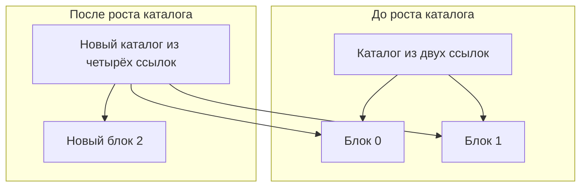

# Массив из блоков фиксированного размера

Статус: теоретический пример для
[модели компоновки и представления](../PAGED-FILE-LAYOUT.md). Приведён эскиз
библиотеки на `Efen`, а не программа для уже существующего компилятора. Имена
вспомогательных типов и методов являются кандидатами программного интерфейса.
Новых ключевых слов они не вводят.

## Что остаётся массивом

`Array<Element, Chunked>` является обычным логическим массивом. Представление
`Chunked` меняет физическое размещение элементов, но сохраняет смысл операций
`Array`:

- элементы образуют последовательность позиций `0 ..< count`;
- индекс обозначает один и тот же элемент независимо от физического блока;
- `append` добавляет элемент в конец;
- `remove` удаляет позицию и сдвигает следующий за ней суффикс влево;
- прямой и обратный обходы следуют порядку логических индексов;
- срез обозначает диапазон исходного массива и не копирует элементы.

Каждый физический блок содержит ровно 256 мест для `Element`. Последний блок
может быть заполнен частично. Отдельный каталог владеет блоками и хранит их в
логическом порядке:

```text
directory[0] -> элементы   0 ..< 256
directory[1] -> элементы 256 ..< 512
directory[2] -> элементы 512 ..< 768
...
```

Размер блока является свойством конкретного аспекта `Chunked`, а не параметром
отдельного объекта массива. Благодаря этому он известен во время компиляции.
Другой размер потребует другого аспекта представления либо будущего явно
параметризованного варианта.

## Кандидаты программного интерфейса

В полном эскизе ниже используются следующие ещё не утверждённые библиотечные и
компиляторные интерфейсы:

- `Representation<Target>` — контракт аспекта представления;
- `implementation Target` — блок, добавляющий поля, конструкторы и методы в
  строящийся конкретный тип;
- `compiler::DefinitionPlan` и его методы — программный интерфейс, через который
  аспект проверяет применимость и регистрирует обычные контракты и физическую
  схему;
- `ChunkBuffer<Element>` — отдельно выделенный блок из 256 мест с учётом того,
  какие места уже инициализированы;
- `ChunkDirectory<Chunk>` — каталог владельческих ссылок на блоки;
- `PreparedCapacity`, `PreparedAppend` и `PreparedReplacement` — владельцы
  подготовленного, но ещё не опубликованного состояния;
- `ChunkRetirement` — владеющий пустым отсоединённым блоком объект, который
  освобождается после завершения фиксации;
- `Mutation.commit` — окно фиксации, внутри которого разрешены только операции,
  не бросающие исключений, не приостанавливающиеся и не вызывающие
  пользовательский код;
- `ArrayPlace<Element>` — логическое место элемента, связанное с исходным
  массивом;
- `PlainLifetime` и `BorrowedElements<Element>` — обычные контракты безопасного
  переноса и заимствования элемента;
- `PhysicalSchema`, `HardConstraints` и `CostHints` — сведения для компилятора о
  физической схеме, обязательных ограничениях и примерной стоимости операций.

Базовые методы принимают обычный `Size`, как и соседние примеры
`Contiguous` и `DynamicContiguous`. Границы проверяет конкретный массив. Индекс
остаётся логическим номером, а не машинным адресом или байтовым смещением.

Все перечисленные операции записаны как обычные вызовы методов `Efen`. В эскизе
нет специальных присваиваний обработчиков, скрытого `Witness` или списка
`capabilities`. Если такое имя будет принято, его поведение должно быть задано
обычным контрактом.

## Общие контракты массива

Эскиз использует те же основные сигнатуры, что непрерывные представления:

| Контракт | Методы |
|---|---|
| основная индексируемая последовательность | `count`, `read(Size)`, `replace(Size, own Element) -> Element`, `slice(Size, Size)` |
| изменение длины | `append(own Element)`, `insert(Size, own Element)`, `remove(Size) -> Element` |
| дополнительное заимствование | `borrowRead(Size)`, `borrowWrite(Size)` |

Основной контракт среза опирается на `read` и не требует возможности
`BorrowedElements`. Методы, возвращающие ссылки на элементы, доступны только при
выполнении этого дополнительного контракта. `Chunked` может его выполнить,
поскольку опубликованный блок не перемещается, пока живо соответствующее
заимствование.

Поле `length` хранит длину внутри представления. Публичный метод `count`
возвращает это поле и тем самым выполняет основной контракт массива. Такое
разделение не создаёт двух независимых значений длины.

## Отображение индекса

После проверки `index < count()` представление вычисляет:

```text
chunk  = index / 256
offset = index % 256
```

`chunk` выбирает запись каталога, а `offset` — место внутри выбранного блока.
Обе операции выполняются над логическими целыми числами. `ChunkBuffer.element`
проверяет границы блока и возвращает типизированное место `Element`.


Ни логический код `Array`, ни аспект `Chunked` не вычисляют выражение вида
`base + index * sizeof(Element)`. Если низкоуровневая реализация
`ChunkBuffer` использует такое выражение, оно остаётся внутри проверенного
источника памяти.

## Полный эскиз аспекта

```efen
aspect Chunked<Target> conforms Representation<Target> {
    meta fn define(plan: compiler::DefinitionPlan) {
        plan.expectGenericType(Target, "Element")
        plan.expectConformance(Target.Element, PlainLifetime)
        plan.addConformance(Target, ResizableSequence<Target.Element>)
        plan.addConformance(Target, BorrowedElements<Target.Element>)
        plan.registerResolver(Target, chunkedIndexing)
        plan.registerSchema(Target, chunkedSequenceSchema)
    }

    implementation Target {
        const CHUNK_SIZE: Size = 256

        struct Position {
            let chunk: Size
            let offset: Size
        }

        struct ReadCursor {
            let owner: &read Target
            let first: Size
            let last: Size
            var cursor: Size

            fn next -> (&read[owner] Target.Element)? {
                if cursor == last {
                    return null
                }

                let index = cursor
                cursor += 1
                return owner.borrowRead(index)
            }

            fn prev -> (&read[owner] Target.Element)? {
                if cursor == first {
                    return null
                }

                cursor -= 1
                return owner.borrowRead(cursor)
            }
        }

        let chunks: ChunkDirectory<ChunkBuffer<Target.Element>>
        var length: Size = 0

        @constructor
        public fn init -> Self {
            self.chunks = ChunkDirectory()
            return self
        }

        @constructor
        public fn initWithCapacity(capacity: Size) -> Self {
            self.chunks = ChunkDirectory()
            self.reserve(capacity)
            return self
        }

        fn chunkCount(elementCount: Size) -> Size {
            if elementCount == 0 {
                return 0
            }

            return 1 + (elementCount - 1) / CHUNK_SIZE
        }

        public fn count -> Size {
            return length
        }

        fn checkIndex(index: Size) {
            if index >= length {
                throw BoundsError(index, length)
            }
        }

        fn checkInsertIndex(index: Size) {
            if index > length {
                throw BoundsError(index, length)
            }
        }

        fn position(uncheckedIndex: Size) -> Position {
            return Position(
                chunk: uncheckedIndex / CHUNK_SIZE,
                offset: uncheckedIndex % CHUNK_SIZE
            )
        }

        fn checkedPosition(index: Size) -> Position {
            checkIndex(index)
            return position(index)
        }

        fn prepareAppend -> PreparedAppend<Target.Element> {
            let destination = position(length)

            if destination.chunk < chunks.count() {
                return PreparedAppend.existing(
                    position: destination
                )
            }

            let directory = chunks.prepareAppend()
            let chunk = ChunkBuffer<Target.Element>.prepare(
                capacity: CHUNK_SIZE
            )

            return PreparedAppend.growing(
                position: destination,
                directory: take directory,
                chunk: take chunk
            )
        }

        fn place(index: Size) -> ArrayPlace<Target.Element> {
            let location = checkedPosition(index)
            return ArrayPlace(
                owner: &read self,
                logicalIndex: index,
                physical: chunks[location.chunk].element(location.offset)
            )
        }

        public fn read(index: Size) -> Target.Element
            where Target.Element: Copyable
        {
            return place(index).value.copy()
        }

        public fn replace(
            index: Size,
            value: own Target.Element
        ) -> Target.Element {
            let replacement = PreparedReplacement(
                destination: place(index),
                value: take value
            )

            return Mutation.commit(take replacement)
        }

        public fn borrowRead(index: Size) -> &read[self] Target.Element {
            let location = checkedPosition(index)
            return &read[self] chunks[location.chunk].element(location.offset)
        }

        public fn borrowWrite(index: Size) -> &[self] Target.Element {
            let location = checkedPosition(index)
            return &[self] chunks[location.chunk].element(location.offset)
        }

        public fn slice(first: Size, last: Size) -> ArraySlice<Self> {
            if first > last || last > length {
                throw RangeError(first, last, length)
            }

            return ArraySlice(
                owner: &self,
                first: first,
                last: last
            )
        }

        public fn readSlice(first: Size, last: Size) -> ArrayReadSlice<Self> {
            if first > last || last > length {
                throw RangeError(first, last, length)
            }

            return ArrayReadSlice(
                owner: &read self,
                first: first,
                last: last
            )
        }

        public fn reserve(minimumCapacity: Size) {
            let requiredChunks = chunkCount(minimumCapacity)

            if requiredChunks <= chunks.count() {
                return
            }

            let prepared = chunks.prepareCapacity(requiredChunks)
            var next = chunks.count()

            while next < requiredChunks {
                prepared.add(
                    take ChunkBuffer<Target.Element>.prepare(
                        capacity: CHUNK_SIZE
                    )
                )
                next += 1
            }

            Mutation.commit(take prepared)
        }

        public fn append(value: own Target.Element) {
            let nextLength = checkedAdd(length, 1)
            let prepared = prepareAppend()
            let destination = prepared.position

            Mutation.commit {
                if prepared.hasNewChunk() {
                    chunks.publishAppend(
                        take prepared.directory,
                        take prepared.chunk
                    )
                }

                chunks[destination.chunk].initialize(
                    destination.offset,
                    take value
                )
                length = nextLength
            }
        }

        public fn insert(
            index: Size,
            value: own Target.Element
        ) {
            checkInsertIndex(index)

            if index == length {
                append(take value)
                return
            }

            let nextLength = checkedAdd(length, 1)
            let prepared = prepareAppend()

            Mutation.commit {
                if prepared.hasNewChunk() {
                    chunks.publishAppend(
                        take prepared.directory,
                        take prepared.chunk
                    )
                }

                var cursor = length
                while cursor > index {
                    let from = position(cursor - 1)
                    let to = position(cursor)
                    let moved = chunks[from.chunk].take(from.offset)
                    chunks[to.chunk].initialize(to.offset, take moved)
                    cursor -= 1
                }

                let destination = position(index)
                chunks[destination.chunk].initialize(
                    destination.offset,
                    take value
                )
                length = nextLength
            }
        }

        public fn removeLast -> Target.Element {
            if length == 0 {
                throw EmptyCollectionError()
            }

            let nextLength = length - 1
            let location = position(nextLength)
            var retirement: own ChunkRetirement? = null

            let removed = Mutation.commit {
                let removed = chunks[location.chunk].take(location.offset)
                length = nextLength

                if location.offset == 0 &&
                    location.chunk + 1 == chunks.count()
                {
                    retirement = chunks.detachLastEmpty()
                }

                return take removed
            }

            if retirement != null {
                ChunkRetirement.release(take retirement!)
            }

            return take removed
        }

        public fn remove(index: Size) -> Target.Element {
            checkIndex(index)

            let nextLength = length - 1
            let first = position(index)
            let oldLast = position(nextLength)
            var retirement: own ChunkRetirement? = null

            let removed = Mutation.commit {
                let removed = chunks[first.chunk].take(first.offset)
                var cursor = index

                while cursor < nextLength {
                    let from = position(cursor + 1)
                    let to = position(cursor)
                    let moved = chunks[from.chunk].take(from.offset)
                    chunks[to.chunk].initialize(to.offset, take moved)
                    cursor += 1
                }

                length = nextLength

                if oldLast.offset == 0 &&
                    oldLast.chunk + 1 == chunks.count()
                {
                    retirement = chunks.detachLastEmpty()
                }

                return take removed
            }

            if retirement != null {
                ChunkRetirement.release(take retirement!)
            }

            return take removed
        }

        public fn iterator -> ReadCursor {
            return ReadCursor(
                owner: &read self,
                first: 0,
                last: length,
                cursor: 0
            )
        }

        public fn reverseIterator -> ReadCursor {
            return ReadCursor(
                owner: &read self,
                first: 0,
                last: length,
                cursor: length
            )
        }

        meta fn physicalSchema -> PhysicalSchema {
            return PhysicalSchema.chunkedSequence(
                element: Target.Element,
                chunkSize: CHUNK_SIZE,
                directoryMayMove: true,
                chunksMayMove: false,
                initializedPrefix: length
            )
        }

        meta fn hardConstraints -> HardConstraints {
            return HardConstraints(
                indexMapping: quotientAndRemainder,
                stableChunkWhileBorrowed: true,
                structuralMutationWhileBorrowed: false,
                forwardTraversal: true,
                backwardTraversal: true
            )
        }

        meta fn costHints -> CostHints {
            return CostHints(
                index: constant,
                sequentialForward: linearTotal,
                sequentialBackward: linearTotal,
                appendPrepared: constant,
                appendAmortized: constant,
                insert: linearSuffix,
                remove: linearSuffix,
                slice: constant,
                crossesAllocationEvery: CHUNK_SIZE
            )
        }
    }
}
```

Эскиз показывает одну цельную реализацию, но не предлагает сделать
`ChunkDirectory`, `ChunkBuffer` или `Mutation.commit` конструкциями языка. Это
кандидаты обычной библиотеки памяти. Необычные записи `PhysicalSchema`,
`HardConstraints` и `CostHints` также являются кандидатами программного
интерфейса компилятора; до их утверждения они служат типизированной записью
требуемых сведений.

Метод `define` также использует кандидатный программный интерфейс компилятора.
Он проверяет наличие типа `Target.Element` и выполнение `PlainLifetime`, затем
регистрирует `BorrowedElements`, общее разрешение индексирования и физическую
схему. Эти вызовы не вводят отдельный скрытый протокол для `Chunked`.

Все определения без параметров записаны без `()`: `init`, `count`,
`prepareAppend`, `removeLast`, `iterator`, `reverseIterator`, `next`, `prev`,
`physicalSchema`, `hardConstraints` и `costHints`. Вызовы сохраняют скобки,
например `iterator()` и `next()`.

## Рост без переноса старых блоков

Каталог хранит владельческую ссылку на каждый отдельно выделенный блок. При
росте каталог может выделить более крупный массив ссылок и перенести в него эти
ссылки. Сами `ChunkBuffer` и уже созданные `Element` остаются на месте.



Поэтому добавление первого элемента очередного блока выполняет три отдельные
подготовки:

1. каталог резервирует место для новой ссылки;
2. источник памяти выделяет новый `ChunkBuffer`;
3. готовое значение `Element` переносится в первое место блока.

Первые две стадии могут завершиться ошибкой до изменения массива. После их
успеха `Mutation.commit` публикует ссылку на блок, инициализирует место и
записывает заранее проверенное значение `length` без бросающих операций.

Это физическое свойство само по себе не разрешает менять массив при живом
заимствовании. Базовый контракт `Borrow` удерживает структурное заимствование
всего массива, поэтому `append`, `insert`, `remove` и `reserve` в это время
недоступны. Более узкий контракт устойчивых ссылок можно рассмотреть отдельно.

## Конструкторы и резервирование

`init` создаёт пустой каталог и не выделяет блоков. `initWithCapacity` заранее
подготавливает каталог нужного размера. В эскизе он не создаёт заполненных
элементов: `length` после конструктора остаётся равен нулю, а `count()`
возвращает ноль.

Метод `reserve` округляет требуемую вместимость вверх до целого числа блоков:

```text
requiredChunks = ceil(minimumCapacity / 256)
capacity       = directory.count * 256
```

Вычисление записано как `1 + (elementCount - 1) / 256`, поэтому оно не требует
складывать `elementCount + 255` и не создаёт лишний риск переполнения. Сам
`ChunkDirectory` обязан проверять переполнение размера каталога и общий предел
адресуемой памяти.

Подготовленный конструктор или `reserve` владеет всеми новыми блоками. При
ошибке уже выделенные блоки уничтожаются автоматически, а исходный массив не
меняется. Публикация подготовленного каталога не бросает исключений.

## Логическое место и заимствование

`place(index)` связывает три сведения:

- происхождение от конкретного массива;
- логический индекс;
- типизированное физическое место в выбранном блоке.

Физическое место остаётся закрытой частью `ArrayPlace`. Внешний код не может
получить номер блока, заменить каталог или принять `(chunk, offset)` за
универсальный указатель.

Чтение копии допустимо только для `Copyable` элемента. `replace` принимает
новый элемент во владение и возвращает вытесненный элемент, поэтому копирование
не требуется. Если вызывающий код игнорирует результат присваивания, разрушение
старого значения происходит после фиксации нового состояния.

`borrowRead` и `borrowWrite` относятся к дополнительному контракту
`BorrowedElements`. Они возвращают логические ссылки с происхождением массива и
могут свестись к машинному адресу внутри неподвижного блока. Контракт обещает
только ссылку `Efen`; переход к `raw` требует отдельного договора об
адресуемости и времени стабильности.

## Срез через границу блоков

В этом эскизе `ArrayReadSlice` и `ArraySlice` хранят исходный массив и границы.
Они не создают второй каталог и не собирают массив указателей. Например, срез
`250 ..< 270` состоит из двух физических частей:

```text
блок 0: смещения 250 ..< 256
блок 1: смещения   0 ..< 14
```

Логически это по-прежнему один диапазон длиной 20. Метод чтения среза вычисляет
позицию `first + i` и применяет обычную формулу деления. Этот основной доступ
копирует значение и не требует `BorrowedElements`. Дополнительный метод
заимствования возвращает ссылку только при наличии этого контракта.
Итератор может оптимизировать последовательный обход: обработать остаток первого
блока, затем целые блоки, затем начало последнего. Такая оптимизация не меняет
порядок элементов.

Этот выбор внутреннего устройства среза остаётся кандидатом данного примера:
общая модель ещё не утверждает, какие именно поля должна хранить структура
среза.

## Итератор вперёд и назад

`ReadCursor` хранит неизменные границы `first`, `last` и единственную позицию
`cursor` внутри `first ... last`. Метод `next` возвращает элемент в `cursor` и
увеличивает позицию. Метод `prev` сначала уменьшает ту же позицию и возвращает
предыдущий элемент. Поэтому вызов `prev` сразу после успешного `next` возвращает
тот же элемент и отменяет переход вперёд. Это обычный двунаправленный курсор, а
не обход двумя независимо сужающимися концами.

Оба перехода имеют постоянную стоимость. На границе блока следующий индекс
автоматически даёт новую пару `(chunk, offset)`. Сохранённый курсор является
обычным значением `Efen`; при непосредственном цикле компилятор может встроить
формулу и обходить последовательные места текущего блока без повторного деления
на каждом шаге.

## Добавление и удаление

`append` имеет постоянную стоимость, если в последнем блоке осталось место. На
границе блока требуется одно выделение блока и иногда рост каталога. Старые
элементы не переносятся, поэтому средняя стоимость добавления остаётся
постоянной.

`insert(index, value)` сохраняет семантику массива и сдвигает суффикс вправо.
Перенос через границу блоков ничем не отличается от переноса внутри блока:
каждый логический индекс заново отображается в физическую пару. Стоимость равна
`O(count - index)`.

`removeLast` переносит последний элемент вызывающему и имеет постоянную
стоимость. Если удалённый элемент был единственным в последнем блоке, пустой
блок отсоединяется от каталога внутри фиксации. Полученный `ChunkRetirement`
освобождает его после завершения фиксации и внутренних заимствований.

`remove(index)` сначала переносит удаляемый элемент во временного владельца,
затем сдвигает суффикс влево. Старое последнее место после сдвига уже не содержит
значения. Пустой последний блок сначала отсоединяется во владеющий
`ChunkRetirement`, а освобождается уже после восстановления последовательности.

Если требуется удаление без сохранения порядка, стандартная библиотека может
предоставить отдельную операцию обмена с последним элементом. Она не может
заменять обычный `remove`, потому что изменила бы логический смысл массива.

## Владение и безопасность при ошибках

Для каждой изменяющей операции действует один порядок:


До `Mutation.commit` подготовленные объекты владеют новой памятью и обеспечивают
откат через обычное разрушение. В окне фиксации запрещены выделение памяти,
бросающие конструкторы, приостановка и пользовательские обратные вызовы.

`define` требует от `Target.Element` контракт `PlainLifetime`: перенос значения,
его освобождение и обслуживание пустого места не бросают исключений, не
приостанавливаются и не вызывают пользовательский код. Поэтому `append`,
`insert` и `remove` могут переносить элементы внутри окна фиксации. Если тип
элемента не удовлетворяет этому условию, аспект неприменим. Альтернативное
представление могло бы подготовить весь суффикс до фиксации, но данный эскиз
такого пути не предоставляет.

`append` и `insert` вычисляют `nextLength = checkedAdd(length, 1)` до подготовки
и фиксации. Переполнение поэтому не может возникнуть после начала изменения.
Удаление также вычисляет конечную длину заранее после проверки непустоты или
индекса.

Разрушитель удалённого или вытесненного значения выполняется после выхода из
окна фиксации и освобождения внутренних изменяемых заимствований. Поэтому
повторный вход пользовательского кода не наблюдает незавершённый сдвиг.

При уничтожении всего массива сначала разрушаются инициализированные элементы
`0 ..< length`, затем освобождаются блоки, затем каталог. Неинициализированный
хвост последнего блока не читается и не разрушается.

## Физическая схема и стоимость

Обязательная физическая схема сообщает компилятору:

- логическая последовательность разбита на блоки по 256 мест;
- каждый блок хранит последовательный диапазон индексов;
- каталог может перемещаться, а опубликованные блоки остаются на месте;
- заполненные места образуют общий префикс `0 ..< length`;
- прямой и обратный переходы существуют;
- структурное изменение запрещено при живом базовом заимствовании.

Оценки стоимости не влияют на правильность. Ошибочная оценка может дать менее
быстрый план, но не разрешает нарушить происхождение ссылки, границы или порядок
наблюдаемых действий.

| Операция | Стоимость | Физическое свойство |
|---|---:|---|
| индексирование | `O(1)` | одно деление и два доступа |
| последовательный обход | `O(count)` | переход каталога раз в 256 элементов |
| обратный обход | `O(count)` | та же схема в обратном порядке |
| `append` | `O(1)` в среднем | старые блоки не переносятся |
| `removeLast` | `O(1)` | иногда освобождается один блок |
| `insert(i)` | `O(count - i)` | суффикс сдвигается вправо |
| `remove(i)` | `O(count - i)` | суффикс сдвигается влево |
| создание среза | `O(1)` | сохраняются начало и длина |
| лишняя вместимость без `reserve` | меньше 256 мест | только хвост последнего блока |
| каталог | `O(ceil(count / 256))` | одна владельческая ссылка на блок |

Компилятор может использовать схему и подсказки, чтобы объединять обращения
внутри блока, разворачивать внутренний цикл на 256 элементов, предварительно
загружать следующую запись каталога и выбирать обратный обход. Он не вправе
менять порядок пользовательских эффектов или обращаться к неинициализированному
хвосту блока.

## Проверка логического контракта

Для каждого опубликованного состояния должны выполняться свойства:

```text
count() == length
length <= chunks.count * 256
chunks.count == ceil(length / 256), если лишний reserve не сохраняется
все места 0 ..< length инициализированы ровно один раз
все места length ..< capacity неинициализированы
elementAt(i) == chunks[i / 256][i % 256]
append(x) == старая последовательность + [x]
insert(i, x) == prefix(i) + [x] + suffix(i)
remove(i) возвращает старый elementAt(i) и сохраняет порядок остальных
next выдаёт индексы по возрастанию без повторов
prev выдаёт индексы по убыванию без повторов
срез через границу блока совпадает с тем же логическим диапазоном
рост каталога не перемещает опубликованные блоки и элементы
```

Если `reserve` сохраняет заранее выделенные пустые блоки, второе равенство
ослабляется до `chunks.count >= ceil(length / 256)`. Остальные свойства от этого
не меняются. Их следует проверять одними модельными тестами для `Contiguous`,
`Chunked`, `List`, `DoubleLinkedList`, `Columnar` и файлового представления.
